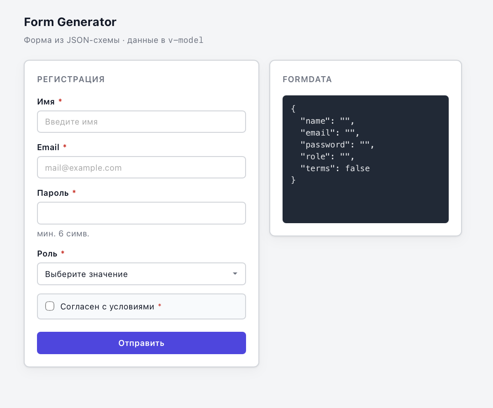

# vue3-form-generator


Vue 3 · TypeScript · Vitest

Компонент `FormGenerator` — динамическая форма по JSON-схеме с `v-model` и валидацией.


## Быстрый старт

```bash
git clone https://github.com/willalone/vue3-form-generator.git
cd vue3-form-generator
npm install
npm run dev
```

Откроется http://localhost:5173 — демо с формой из ТЗ и live-preview `formData` справа.

```bash
npm test        # 45 тестов
npm run build   # production-сборка
```

## Использование

```vue
<script setup lang="ts">
import { ref } from 'vue'
import FormGenerator from './components/FormGenerator/FormGenerator.vue'

const formData = ref({})
const formSchema = { fields: [/* ... */] }
</script>

<template>
  <FormGenerator v-model="formData" :schema="formSchema" @submit="console.log" />
  <pre>{{ formData }}</pre>
</template>
```

## API FormGenerator

| Prop / event | Тип | Описание |
|--------------|-----|----------|
| `schema` | `FormSchema` | JSON-схема полей |
| `v-model` | `FormData` | `modelValue` + `update:modelValue` (computed getter/setter) |
| `@submit` | `(data: FormData) => void` | Валидные данные при отправке |

`defineExpose`: `isValid`, `errors`, `submit()`.

## Поля схемы

| Ключ | Описание |
|------|----------|
| `type` | `text`, `email`, `password`, `select`, `checkbox` |
| `label` | подпись |
| `model` | ключ в `formData` |
| `required` | обязательность |
| `minLength` | мин. длина |
| `pattern` | regex-строка |
| `placeholder` | placeholder для text/email/password |
| `disabled` | блокировка поля |
| `readonly` | только чтение (input) |
| `autocomplete` | атрибут autocomplete |
| `options` | варианты для `select` |

Пример — `src/demoFormSchema.ts` (схема из тестового задания).

## Структура

```
src/components/FormGenerator/
  FormGenerator.vue   — компонент
  FormField.vue       — поле
  useFormGenerator.ts — логика формы
  useFormField.ts     — логика поля
src/composables/useFormValidation.ts
src/App.vue           — демо
```

## Демо


